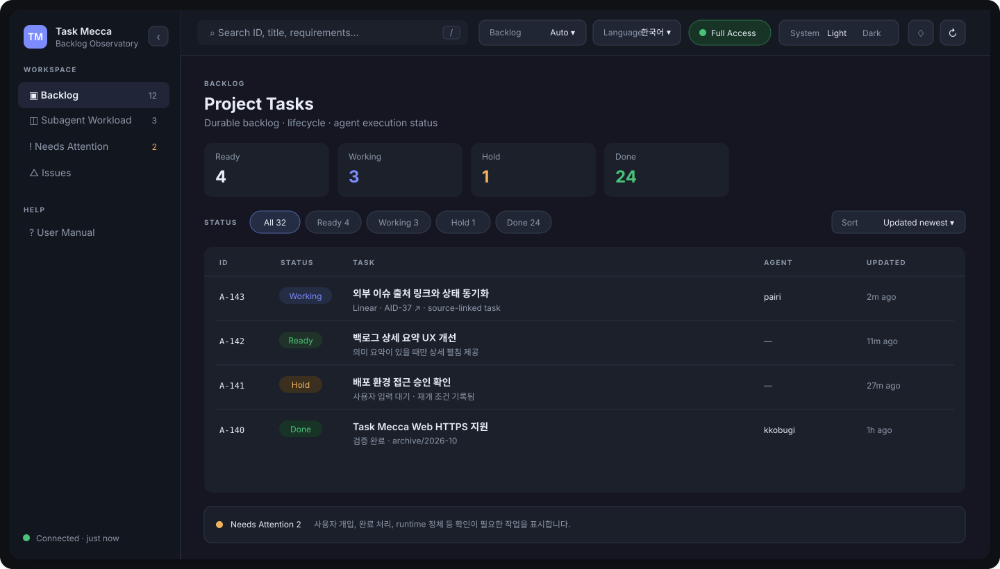

# Task Mecca

작업 완료 근거로 과거 실행 관측 미확인 경고를 해소하되 runtime 완료 사실을 만들지 않습니다. 정확한 사건의 무전송 CLI preview/적용과 process-only Telegram 유지보수 안전 절차는 [완료 작업의 실행 관측 재조정](docs/A-23-completed-runtime-observation.md)을 참고하세요.

**Task Mecca는 서브에이전트 기반 작업을 백로그로 기록·수행·관리하고, Web UI에서 진행 상태와 lifecycle을 모니터링하는 local-first AI 협업 도구입니다.**  
사용자는 한 개의 Root와 자연어로 대화하고, Task Mecca는 Registrar·Controller·Worker 역할을 통해 작업 정의가 흐트러지지 않도록 등록·병렬 수행·검증·완료 기록을 이어갑니다.

[English README](README.md)

> **프로젝트의 시작**  
> Task Mecca는 동료가 공유한 초기 소스와 백로그 기반 협업 아이디어에서 출발해 발전한 프로젝트입니다.  
> → [프로젝트의 시작과 감사](#project-origin)

## 빠른 시작

사용하면서 구조를 익히는 것이 가장 빠릅니다.

### 1. 설치

macOS / Linux:

```bash
curl -fsSL https://raw.githubusercontent.com/silverkhan/TaskMecca/main/install.sh | sh
```

Windows PowerShell:

```powershell
irm https://raw.githubusercontent.com/silverkhan/TaskMecca/main/install.ps1 | iex
```

Windows 설치 스크립트는 정식 배포 파일의 SHA-256을 검증한 뒤 사용자 영역에 설치하고 PATH를 자동 등록하므로 관리자 권한이 필요하지 않습니다.

최종 사용자는 Python, `uv`, Go toolchain을 설치할 필요가 없습니다.

### 2. 프로젝트 초기화

Task Mecca를 사용할 프로젝트 루트로 이동합니다.

```bash
cd /path/to/your/project
task-mecca init
```

초기화는 Task Mecca framework와 운영 문서를 설치합니다. 실제 backlog는 첫 작업이 등록될 때 생성됩니다.


### 운영 지침 업데이트

설치 후 현재 원본의 `_task_mecca/framework/EXECUTION_PROTOCOL.md`와 역할 문서를 함께 적용합니다. 기존 설치는 지원되는 migration 흐름으로 갱신하고, 사용자 수정 managed 문서는 백업·동의 절차를 따릅니다. `data/`와 `.runtime/`을 배포 템플릿으로 덮어쓰지 않습니다. 지침 변경 뒤 Root뿐 아니라 재사용 Controller/Worker도 새 배정 전에 변경된 지침을 다시 읽습니다. canonical 원장은 원본에 유지하고 구현 worktree 사본은 등록하지 않습니다.

### 3. 사용하는 LLM 세션을 Task Mecca Root로 활성화

프로젝트 초기화가 끝나면 **같은 프로젝트 루트에서 Codex, Claude Code 등 자신이 사용하는 Agent/LLM 대화 세션을 엽니다.**

Task Mecca를 사용자와 직접 대화하는 **Root 세션은 하나만 선택**합니다. 그 세션에 아래 프롬프트를 그대로 붙여넣습니다.

```text
이 세션에서는 Task Mecca의 Root로 동작해 주세요.
먼저 _task_mecca/framework/SESSION_GUIDE.md, _task_mecca/framework/collab.md, _task_mecca/framework/roles/root.md를 읽고 그 규약을 따르세요.
사용자에게 보이는 대화와 백로그의 제목·요약·요건·상태·결과는 사용자가 주로 쓰는 언어와 용어 감각을 기준으로 자연스럽게 작성하세요. 정확한 식별자·명령·경로·전문용어로 필요한 영문은 유지하되, 내부 영문 수식어·어순을 기계적으로 섞지 말고 전체 표현을 사용자 언어의 자연스러운 문장으로 재구성하세요.
Linear, GitHub Issue 등 연결된 외부 업무 항목에서 시작된 작업은 원천 항목을 읽고 백로그에 클릭 가능한 출처를 보존하세요. Root는 등록 전 또는 사용자와 활성 대화 중 확정된 중요한 합의를 원천 항목에 반영하고, 등록 이후 실제 작업 상태 변화와 완료 결과는 Controller가 연결된 도구를 통해 직접 반영하도록 하세요. Worker는 외부 이슈를 직접 수정하지 않으며 구현·검증 근거를 Controller에 보고하게 하세요. 외부 원천의 변경이 현재 Task Mecca 계약과 충돌해 사용자 판단이 필요하면 Controller가 임의로 합치지 말고 hold와 확인·후속에 차이와 재개 조건을 남기고, 다음 Root 대화에서 사용자와 재합의하세요.
실행형 작업을 subagent에 위임하기 전에는 SESSION_GUIDE의 Full Access preflight를 먼저 수행하세요.
작업을 Simple Task와 Defined Task로 구분하세요. 추가 해석 없이 바로 검증 가능한 단순 작업은 목표와 수용 기준만 기록하고 바로 등록하며, 범위·설계·사용자 선택이 필요한 작업만 요건 정의서를 작성해 제 확인을 받은 뒤 Registrar에 lossless하게 등록하세요.
아직 backlog가 없다면 Registrar가 첫 등록 시 _task_mecca/data/backlog를 생성하도록 하세요. data 아래의 내용은 project-owned이며 framework updater가 덮어쓰지 않습니다.
등록 이후에는 Controller가 작업 연속성과 의존성을 고려해 Worker에 배분하도록 하고, Root는 사용자-facing 창구로 유지하세요.
```

이 프롬프트의 원본은 [`_task_mecca/ROOT_PROMPT.md`](goassets/template/_task_mecca/ROOT_PROMPT.md)에도 함께 설치됩니다. README와 Web User Manual에서는 처음 사용하는 사람이 파일을 찾아다니지 않아도 바로 복사할 수 있도록 본문을 제공합니다.

프롬프트를 입력한 뒤에는 같은 세션에 자연어로 작업을 요청하면 됩니다.

```text
로그인 API 오류를 수정하고 관련 테스트까지 확인해 주세요.
```

Task Mecca가 작업의 성격에 따라 바로 실행 가능한 **Simple Task** 또는 논의와 합의가 필요한 **Defined Task**로 정리한 뒤 백로그 등록과 수행을 이어갑니다.

### 4. Web UI 실행

새 터미널 또는 현재 터미널에서 프로젝트 루트 기준으로 실행합니다.

```bash
task-mecca web
```



Web UI에서 다음을 한눈에 볼 수 있습니다.

- Backlog의 `Ready / Working / Hold / Done` 상태
- 현재 서브에이전트 작업량과 담당 작업
- Queue / Active / Wait / Lead Time 및 lifecycle
- 사용자 확인, 완료 처리, runtime 정체 등 **Needs Attention**
- 외부 이슈 출처, 최근 업데이트, 작업 상세와 검증 결과
- 버전 Update / 프로젝트 framework migration
- Root 프롬프트와 상세 사용자 매뉴얼

기본 포트는 `18765`입니다. Tailscale이 준비된 환경에서는 별도 `tailscale serve` 없이 직접 HTTPS endpoint도 제공합니다.

## 어떻게 동작하나요?

```text
사용자
  ↕
Root                작업 논의·정의
  ├─ Registrar      확정 내용을 백로그에 그대로 등록
  └─ Controller     작업 순서·병렬 실행·Worker 관제
       ├─ Worker
       ├─ Worker
       └─ ...

        ↓
Markdown backlog + Git lifecycle
        ↓
Task Mecca Web UI
```

핵심 원칙은 단순합니다.

- **작업 정의를 대화 속에만 두지 않습니다.** Markdown backlog에 durable하게 남깁니다.
- **Worker는 전달받은 짧은 요약이 아니라 원래 작업 계약을 직접 읽습니다.**
- **여러 Worker의 실행과 중단·재개·완료를 Controller가 관제합니다.**
- **Linear / GitHub Issue에서 시작한 작업은 출처를 연결하고, Root가 중요한 합의를, Controller가 실제 상태 변화와 완료 결과를 원천 이슈에 반영합니다.**
- **사용자가 읽는 내용은 사용자의 언어와 업무 맥락을 우선합니다.**

## 버전 Update

Task Mecca는 **Stable / Dev** 두 업데이트 채널을 지원합니다.

- `stable`은 기본 채널이며 `main → release-stable` 정식 빌드만 받습니다.
- `dev`는 명시적으로 선택한 개발자용 채널이며 `dev → release-dev` 개발 빌드를 받습니다.
- 개발 빌드는 다음 정식 버전을 기준으로 `0.2.46-dev.1`, `0.2.46-dev.2`처럼 증가하고, 정식 승격 시 `0.2.46`이 됩니다.

현재 채널 확인/변경:

```bash
task-mecca channel
task-mecca channel dev
task-mecca channel stable
```

채널 선택은 로컬 설치에 저장되므로 일반 사용자는 별도 설정 없이 계속 Stable만 추적합니다.

### Web에서

새 버전이 있으면 Web UI에 Update 상태가 표시됩니다. Web에서 업데이트를 실행할 수 있으며, 프로젝트 framework가 함께 갱신되어야 하는 경우 migration도 안내합니다.

### 터미널에서

CLI 업데이트:

```bash
task-mecca upgrade
```

현재 프로젝트의 managed framework 업데이트:

```bash
task-mecca migrate
```

macOS/Linux에서는 CLI 업데이트 중 Web이 실행 중이면 새 실행파일로 자동 재시작합니다. Windows는 실행 중인 실행파일 교체 제약 때문에 필요한 종료/재실행 절차를 안내합니다.

## 기본 명령어

| 명령 | 용도 |
|---|---|
| `task-mecca init` | 현재 프로젝트 초기화 |
| `task-mecca web` | Web UI 실행 |
| `task-mecca web status` | Web 서비스 상태 확인 |
| `task-mecca web restart` | Web 서비스 재시작 |
| `task-mecca upgrade` | Task Mecca CLI 업데이트 |
| `task-mecca channel [stable|dev]` | 업데이트 채널 확인/변경 |
| `task-mecca migrate` | 프로젝트 framework 업데이트 |
| `task-mecca status` | 현재 backlog 상태 요약 |
| `task-mecca inspect <ID>` | 특정 작업 상세 확인 |
| `task-mecca ready` | 실행 가능한 작업 확인 |
| `task-mecca workload` | Worker 작업량 확인 |
| `task-mecca coordinate` | Controller scheduling snapshot 확인 |
| `task-mecca doctor` | backlog 및 운영 상태 점검 |

대부분의 작업에서 사용자가 이 명령을 직접 조합할 필요는 없습니다. 일반적인 사용 방식은 **Root와 자연어로 대화하고, Agent가 필요한 Task Mecca 명령을 사용하는 것**입니다.

## 더 자세히

README는 처음 사용하는 데 필요한 내용만 담습니다. 세부 운영 규칙은 프로젝트에 함께 설치되는 문서와 Web의 **User Manual**에서 확인할 수 있습니다.

- [Root 프롬프트](goassets/template/_task_mecca/ROOT_PROMPT.md)
- [Session Guide](goassets/template/_task_mecca/framework/SESSION_GUIDE.md)
- [협업 규약](goassets/template/_task_mecca/framework/collab.md)
- [사람이 읽기 편한 Backlog 가이드](goassets/template/_task_mecca/framework/HUMAN_READABLE_BACKLOG.md)
- [Tags / Taxonomy](goassets/template/_task_mecca/framework/TAGS.md)
- [역할별 규약](goassets/template/_task_mecca/framework/roles/)

<a id="project-origin"></a>

## 프로젝트의 시작과 감사

Task Mecca는 제 동료인 [gyusu](https://github.com/gyusu)로부터 받은 아이디어와 영감에서 시작되었습니다.

초기에는 백로그를 등록하는 세션과 백로그를 수행하는 Worker 세션을 분리하고, Worker가 `/goal` 방식으로 남아 있는 백로그를 계속 선택·수행하여 백로그가 소진될 때까지 작업을 이어가는 AI 협업 구조에 대한 아이디어를 공유받았습니다. 또한 이러한 방식을 실제로 탐색하고 구현하는 데 참고할 수 있는 소스도 함께 제공받았습니다.

이 아이디어는 Task Mecca를 만들게 된 중요한 출발점이 되었습니다.

이후 Task Mecca는 이 초기 개념을 바탕으로 Root, Registrar, Controller, Worker의 역할 체계, 작업 관제와 병렬 실행, 백로그 생명주기 관리, Web UI, 외부 업무 원천 연결, 설치 및 배포 체계 등으로 지속적으로 확장되며 현재의 구조로 발전했습니다.

초기의 아이디어와 영감을 나누어 준 [gyusu](https://github.com/gyusu)에게 감사드립니다.

## 개발 / 라이선스

```bash
go test ./...
go build ./cmd/task-mecca
```

Python compatibility runtime도 유지합니다. 자세한 내용은 [CONTRIBUTING.md](CONTRIBUTING.md)를 참고하세요.

MIT License · [LICENSE](LICENSE)

## Hub 제거 이력과 복구 가능한 정리

제거 이력은 기본 접힘이며 제목·건수·확인 필요 상태가 보입니다. 같은 브라우저의 접기/펼치기 선택을 유지합니다. Hub 등록 제거, 이력 삭제, 폴더 정리는 각각 별도 확인이며 이력 삭제는 파일을 지우지 않습니다.

폴더 정리는 macOS Foundation 기본 휴지통 또는 Windows IFileOperation 시스템 휴지통(로컬 고정 드라이브만)을 사용합니다. identity와 덮어쓰기 방지를 확인하여 같은 볼륨의 고유 임시 폴더에 먼저 이동합니다. 시스템 휴지통에서 복원 후 기록된 임시 경로에서 원래 절대 경로로 옮기세요. 기존 폴더를 덮어쓰지 마세요. 원본 저장소·공용/관리 루트·심볼릭링크/reparse point·UNC/device/이동식 드라이브·미지원 OS는 거부하며 영구 삭제로 대체하지 않습니다. Linux는 명시적 미지원입니다.

실패 이유와 재시도 조건을 이력에 남깁니다. 부분 실패/결과 미확인은 원본·임시 경로·시스템 휴지통을 먼저 확인해야 합니다. 이동 뒤 이력 저장 실패는 복구 위치를 알리며 성공으로 표시하거나 위험한 파일시스템 rollback을 하지 않습니다. macOS 개인정보 보호 거부는 실제 서비스 앱의 파일 및 폴더/전체 디스크 접근 허용 후 명시적 재시도가 필요할 수 있으며 앱이 권한을 바꾸지는 않습니다.

CLI도 동일한 안전 규칙을 사용합니다: `task-mecca projects list|history`; 변경은 `pause|resume|remove|delete-history|trash --path ABSOLUTE`. 제거/이력 삭제/휴지통은 `--confirm-path EXACT`, 이력 삭제/휴지통은 `--history-id ID`도 필요합니다. macOS/Windows CI는 cross-build만이 아니라 고유 fixture 실제 휴지통 이동·복원 후 내용 hash를 검증합니다.
