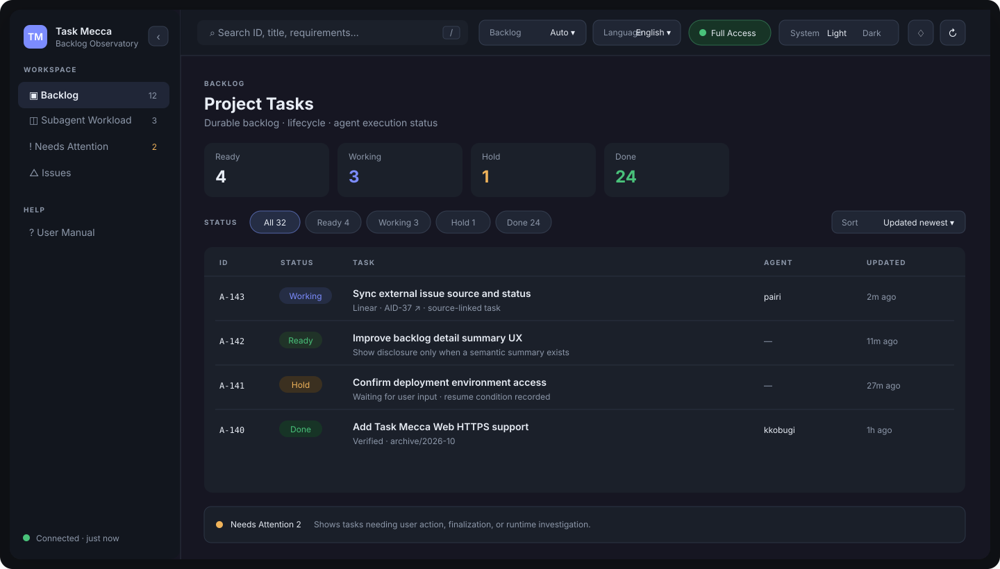

# Task Mecca

**Task Mecca records, executes, and manages subagent-based work through a durable backlog, with a Web UI for lifecycle and execution monitoring.**  
The user talks naturally to a single Root while Registrar, Controller, and Workers preserve task definitions, coordinate parallel work, verify results, and keep execution history inside the project.

[한국어 README](README.ko.md)

> **Project origin**  
> Task Mecca grew from initial source material and a backlog-driven AI collaboration idea shared by a colleague.  
> → [Project origin & acknowledgements](#project-origin)

## Quick Start

The fastest way to learn Task Mecca is to use it.

### 1. Install

macOS / Linux:

```bash
curl -fsSL https://raw.githubusercontent.com/silverkhan/TaskMecca/main/install.sh | sh
```

Windows PowerShell:

```powershell
irm https://raw.githubusercontent.com/silverkhan/TaskMecca/main/install.ps1 | iex
```

The Windows installer verifies the SHA-256 checksum of the Stable release, installs into the current user's profile, and registers the directory on PATH without requiring administrator privileges.

End users do not need Python, `uv`, or the Go toolchain.

### 2. Initialize a project

Move to the project root:

```bash
cd /path/to/your/project
task-mecca init
```

Initialization installs the Task Mecca framework and operating manuals. The backlog itself is created when the first task is registered.


### Refresh operating instructions

Apply the installed original `_task_mecca/framework/EXECUTION_PROTOCOL.en.md` together with the role guides. Refresh existing installations through supported migration, following backup/consent policy for customized managed documents. Do not overwrite `data/` or `.runtime/` with distribution templates. After instruction changes, reused Controllers/Workers as well as Root re-read changed guides before new assignments. Keep the canonical ledger in the original project and do not register implementation-worktree copies.

### 3. Activate your LLM session as Task Mecca Root

After initialization, **open the agent/LLM conversation you use—such as Codex or Claude Code—from the same project root.**

Choose exactly one user-facing session to act as the **Root**, then paste the prompt below into that session.

```text
Act as the Task Mecca Root for this session.
First read _task_mecca/framework/SESSION_GUIDE.md, _task_mecca/framework/collab.md, and _task_mecca/framework/roles/root.md and follow those rules.
For all user-facing conversation and backlog prose—titles, summaries, requirements, status, and results—write natively in the user's primary language and vocabulary. Keep exact English identifiers, commands, paths, or technical terms when they improve precision, but do not mechanically leak internal English modifiers or word order into another language; restate the whole expression naturally in the user's language.
When work originates from a connected external item such as a Linear or GitHub issue, read that source and preserve a clickable source reference in the backlog. Root writes back important decisions confirmed before registration or during active user discussion. After registration, Controller is the single operational writer for real lifecycle transitions and completion results through the connected capability. Workers do not edit the external issue directly; they report implementation and verification evidence to Controller. If the external source changes in a way that conflicts with the current Task Mecca contract and requires user judgment, Controller must not merge it silently: put the task on hold, record the difference and resume condition in follow-up, and let the next Root interaction reconcile it with the user.
Before delegating executable work to subagents, run the Full Access preflight described in SESSION_GUIDE.
Classify work as Simple Task or Defined Task. For a simple task that is directly verifiable without additional interpretation, record only the goal and acceptance criteria and register it immediately. For work requiring scope, design, or user choices, prepare a requirement definition, get my confirmation, and then ask Registrar to register it losslessly.
If no backlog exists yet, Registrar creates _task_mecca/data/backlog on the first registration. Everything under data is project-owned and is never overwritten by the framework updater.
After registration, let Controller allocate work to Workers based on dependency and continuity, while Root remains the user-facing interface.
```

The same source prompt is installed at [`_task_mecca/ROOT_PROMPT.md`](goassets/template/_task_mecca/ROOT_PROMPT.md). README and the Web User Manual expose the prompt body directly so a first-time user does not need to navigate files before starting.

After sending the prompt, just describe work naturally in the same session:

```text
Fix the login API bug and verify the related tests.
```

Task Mecca classifies the request as a directly executable **Simple Task** or a **Defined Task** that needs scope/design agreement, then continues through backlog registration and execution.

### 4. Launch the Web UI

From the project root, in a new terminal or the current one:

```bash
task-mecca web
```



The Web UI gives you a direct view of:

- `Ready / Working / Hold / Done` backlog state;
- subagent workload and assignments;
- Queue / Active / Wait / Lead Time and lifecycle history;
- **Needs Attention** signals such as user intervention, finalization, or runtime stalls;
- external issue sources, recent updates, task detail, and verification;
- version Update and project framework migration;
- the Root prompt and detailed User Manual.

The default port is `18765`. In a configured Tailscale environment, Task Mecca can also expose its own HTTPS endpoint without a separate `tailscale serve`.

## How it works

```text
User
  ↕
Root                discussion · task definition
  ├─ Registrar      lossless backlog registration
  └─ Controller     scheduling · parallel work · Worker supervision
       ├─ Worker
       ├─ Worker
       └─ ...

        ↓
Markdown backlog + Git lifecycle
        ↓
Task Mecca Web UI
```

The core ideas are intentionally small:

- **Task definitions do not live only in chat.** They are persisted in the Markdown backlog.
- **Workers read the original task contract**, not just a relay summary.
- **Controller supervises parallel execution, waiting, recovery, and completion.**
- **Linear / GitHub Issue work keeps its source link**: Root writes back important decisions, while Controller writes real lifecycle changes and completion results.
- **User-facing language follows the user’s language and work context**, rather than exposing internal agent jargon.

## Version Update

Task Mecca supports **Stable / Dev** update channels.

- `stable` is the default and follows formal `main → release-stable` builds.
- `dev` is opt-in for development and follows `dev → release-dev` builds.
- Dev builds use the next stable version as their base, for example `0.2.46-dev.1`, `0.2.46-dev.2`, and are promoted to `0.2.46` when released.

Check or change the local channel:

```bash
task-mecca channel
task-mecca channel dev
task-mecca channel stable
```

The selected channel is stored locally, so normal users continue to follow Stable unless they explicitly opt into Dev.

### From Web

When a newer version is available, Web shows the Update state and can launch the upgrade. If the project framework also needs migration, Web guides that step as well.

### From the terminal

Upgrade the CLI:

```bash
task-mecca upgrade
```

Update the managed framework in the current project:

```bash
task-mecca migrate
```

On macOS/Linux, a running Task Mecca Web service is restarted with the upgraded executable. Windows provides the required stop/restart guidance when executable replacement requires it.

## Common commands

| Command | Purpose |
|---|---|
| `task-mecca init` | initialize the current project |
| `task-mecca web` | launch Web UI |
| `task-mecca web status` | inspect Web service status |
| `task-mecca web restart` | restart Web service |
| `task-mecca upgrade` | update the Task Mecca CLI |
| `task-mecca channel [stable|dev]` | Show or change the update channel |
| `task-mecca migrate` | update the project framework |
| `task-mecca status` | summarize backlog state |
| `task-mecca inspect <ID>` | inspect one task |
| `task-mecca ready` | show executable work |
| `task-mecca workload` | show Worker workload |
| `task-mecca coordinate` | show Controller scheduling snapshot |
| `task-mecca doctor` | validate backlog and operating state |

Most users should not need to compose these commands manually. The normal workflow is to **talk to Root in natural language and let the agents use Task Mecca commands underneath**.

## Detailed documentation

This README is intentionally limited to what you need to start. Detailed operating rules are installed with each project and are also available in the Web **User Manual**.

- [Root Prompt](goassets/template/_task_mecca/ROOT_PROMPT.md)
- [Session Guide](goassets/template/_task_mecca/framework/SESSION_GUIDE.en.md)
- [Collaboration contract](goassets/template/_task_mecca/framework/collab.md)
- [Human-readable backlog guide](goassets/template/_task_mecca/framework/HUMAN_READABLE_BACKLOG.md)
- [Tags / Taxonomy](goassets/template/_task_mecca/framework/TAGS.md)
- [Role contracts](goassets/template/_task_mecca/framework/roles/)

<a id="project-origin"></a>

## Project origin and acknowledgements

Task Mecca began with ideas and inspiration shared by my colleague [gyusu](https://github.com/gyusu).

The initial concept separated a backlog-registration session from Worker sessions that execute backlog items, with Workers repeatedly selecting and performing remaining work in a `/goal`-style loop until the backlog was exhausted. Reference source material for exploring and implementing that collaboration pattern was also shared with me.

That idea became an important starting point for Task Mecca.

Task Mecca has since expanded the original concept into the Root / Registrar / Controller / Worker role model, task orchestration and parallel execution, backlog lifecycle management, Web UI, external-source integration, and installation/release infrastructure.

Many thanks to [gyusu](https://github.com/gyusu) for sharing the early ideas and inspiration that helped start this project.

## Development / License

```bash
go test ./...
go build ./cmd/task-mecca
```

A Python compatibility runtime is also maintained. See [CONTRIBUTING.md](CONTRIBUTING.md).

MIT License · [LICENSE](LICENSE)
