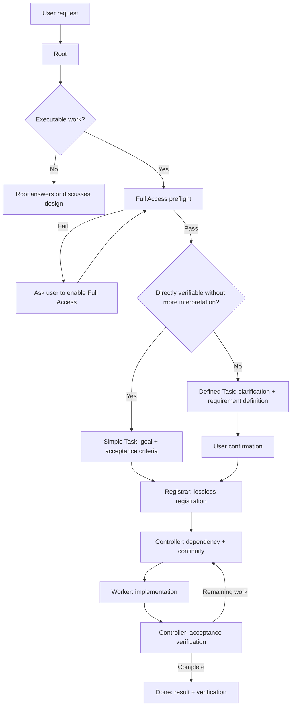

# Task Mecca

For first use, you only need the following three steps.

## 1. Launch the dashboard

```bash
task-mecca web
```

The dashboard automatically detects backlog ledgers under `_task_mecca`. New projects use the canonical `data/backlog/` location. For compatibility, ledgers whose names begin with `backlog` such as `data/backlog_b` or legacy `backlog_b` remain discoverable; canonical `data/backlog/` has highest priority. Use the **Backlog** selector in the top bar to switch folders manually, or choose **Auto** to return to automatic selection.

Completed work under `archive/YYYY-MM/` is read recursively. The **Backlog** screen shows current and completed tasks together. **All** is the default status filter; `Ready / Working / Hold / Blocked / Done` can be combined as multi-select filters.

The default sort is `ID ↓`. You can switch to `ID ↑`, `Updated newest`, or `Updated oldest`. Updated sorting uses each backlog item's last update timestamp. The list now exposes **Updated as a dedicated column**, showing both relative time and date/time without opening the task.

Page size defaults to **Auto**. Task Mecca measures the browser viewport and actual row height so one page fits the available vertical space. You can switch to fixed sizes `10 / 20 / 50`.

Keyboard navigation:

- `↑ / ↓`: move selection
- `Enter` or `→`: open task
- `←` or `Esc`: return to list
- `/`: focus search
- `PgUp / PgDn`: change page

Task details place **Lifecycle immediately below Overview**. Wide screens show a floating right-side TOC; narrower screens show a floating TOC button that opens the same navigation panel.

Use the sidebar arrow to collapse or expand the left navigation. Collapsed mode keeps icons visible; expanded mode shows icons and labels.

The top bar includes a **Language** dropdown. Current languages are `한국어` and `English`. The selection is stored in the browser. Task Mecca UI chrome, generated messages, states, and User Manual follow the selected language. User-authored backlog Markdown is preserved as written and is not automatically translated. The language registry is designed so additional languages can be added later.

The dashboard's Full Access indicator is historical information. Task Mecca runs a fresh active preflight immediately before each subagent dispatch.

### Timing metrics

- **Queue Time**: registration to first `doing`
- **Active Time**: cumulative time across all `doing` intervals
- **Wait Time**: cumulative time across all `hold` intervals
- **Lead Time**: registration to completion; for unfinished work it continues to the current time

If the current filename state is ahead of committed Git lifecycle history, Task Mecca records a provisional observed transition in `.runtime/lifecycle_observations.json`. This keeps Active/Wait timing from resetting while state-transition commits are pending. Git evidence takes precedence when it later arrives.


### Runtime observability and Hook trust

**Subagent Workload → Runtime execution observability** collects actual Codex/Claude execution events through project Hook configuration. Hooks are not separate programs; they are configuration rules that connect provider events to `task-mecca runtime observe ...`.

**Configured is not the same as trusted or observed.**

- **Codex**: after Task Mecca adds rules to `.codex/hooks.json`, Codex may still require Hook trust review. In the CLI/TUI, open `/hooks` and review/trust the Task Mecca Hooks. Start/Stop events from subagents that began or ended before approval may not be recoverable, so create a **new subagent after approval** to verify. Changing a Hook definition may require trust review again.
- **Claude Code**: settings Hooks in `.claude/settings.json` do not use the same per-Hook approval model. Interactive sessions require the project to be **workspace-trusted**. `claude -p`/SDK sessions may run settings Hooks without a separate trust dialog.

Web distinguishes `Not configured / Verification needed / Observation confirmed` and separately shows whether Activity / Start / Stop events have actually been received. When Task Mecca cannot directly verify provider trust state, it does not infer approval.

CLI management:

```bash
task-mecca runtime hooks status all
task-mecca runtime hooks enable codex
task-mecca runtime hooks enable claude
task-mecca runtime hooks disable codex
task-mecca runtime hooks disable claude
```

`disable` removes only Task Mecca-managed Hook handlers and preserves unrelated Hooks. Turning observation off does not delete the existing Execution Ledger.

### Root Session runtime management

Runtime observations are grouped by **Root Session** instead of being presented as one flat list of agents.

```text
Project
└─ Root Session
   ├─ Registrar
   ├─ Controller
   └─ Worker
      └─ Execution Attempt
```

The provider Hook `session_id` is used as the provider-native Root Session identity. Task Mecca derives a stable internal `root_session_id` from provider + session ID, so the same worker path in different Roots remains separated.

Web prefers a human-readable provider session/thread name, then a provider title. If the current observation surface cannot reliably provide either, Task Mecca shows a deterministic fallback such as `Root · YYYY-MM-DD HH:mm`. The name is display metadata only and never liveness evidence.

When exact creation time is unavailable, Web labels the earliest Hook evidence as **First observed** instead of pretending it is the actual creation time.

Root Session states:
- `active`: at least one child has current execution evidence
- `needs_check`: a child is non-terminal but stale/runtime_unknown
- `terminal`: all observed children are terminal
- `inactive_terminal`: terminal and inactive for at least 7 days

Creating a new Root does not automatically terminate an older Root.

**Root-level cleanup** is allowed only for `inactive_terminal` Roots that have been inactive for at least 7 days. It removes that Root's Controller/Registrar/Worker/attempt runtime evidence as one unit while preserving other Roots, canonical backlog/Git, and Hook configuration. A Root with any stale/runtime_unknown child remains protected regardless of age.

## Framework / Data boundary

Installation deploys only `framework/`; it does not create `data/`. On the first task registration Registrar uses `ensure-backlog` to select an existing ledger or create `_task_mecca/data/backlog/`. Durable artifacts created by agents belong under `data/`, not inside `framework/`.

## 2. Activate the Root session

Task Mecca installation and Root activation are separate.

```text
Task Mecca installed in the project ≠ this session is Root
```

Installation does not create or modify the project-level `AGENTS.md`. Project-wide activation would blur the role boundary between the single user-facing Root session and other sessions/agents.

Choose the **one user-facing session** that should act as Root and paste the English Root prompt.

The Web user manual shows the actual prompt directly under **Quick Start → Root session prompt**, with one-click copy. To inspect the source file directly, use:

```text
_task_mecca/ROOT_PROMPT.md
```

After that explicit activation, that session acts as `/root` and can receive work in natural language.

## 3. Assign work

There is no special command syntax. Describe the task to Root in natural language or Markdown.

```text
Fix the incorrect command shown in README.
```

This is typically a **Simple Task**: goal and acceptance criteria are already clear.

```text
Improve backlog auto-discovery and change archive, filtering, and sorting behavior while preserving compatibility.
```

This is typically a **Defined Task**: Root clarifies the request, writes a requirement definition, gets user confirmation, then Registrar → Controller → Worker handles execution.

Root chooses the lane based on whether the request is directly verifiable without additional interpretation, not simply by task size.

## Task Mecca workflow



The Web UI renders fenced `mermaid` blocks as diagrams and lets you view/copy the source.

For full operating rules, open **HELP → User Manual → Detailed Operations Guide** or read `SESSION_GUIDE.en.md`.

## Installation and update ownership

When Task Mecca is installed through the public bootstrap package, `_task_mecca/manifest.json` records the installed version and baseline hashes.

- **Framework managed**: `web/*` and framework documentation. The runtime is embedded in the standalone `task-mecca` binary and does not require project-local Python files.
- **Customizable managed**: `roles/*`, `SESSION_GUIDE*.md`, `collab.md`, `_template.md`, and Task Mecca manuals. If both the project copy and upstream changed, the migrator lists those files, recommends a backup, creates one when approved, then warns before overwrite.
- **Project owned**: all `_task_mecca/data/**`. Registrar creates `data/backlog/` on first registration; the migrator never overwrites `data/**`. Pre-0.2 `backlog*` locations remain project-owned compatibility paths.
- **Runtime/backup**: `.runtime/*` and `backups/*`. Local-only operational/safety data and ignored by Git by default.

Update the bootstrap package first, then update the project's managed framework.

Task Mecca is distributed as a standalone `task-mecca` executable. Put the binary for your operating system on PATH, then run from the project root:

```bash
task-mecca init
task-mecca web
```

After replacing the binary with a newer release, update managed framework files with:

```bash
task-mecca migrate
```

If migration changes instructions that affect the active session—such as `ROOT_PROMPT.md`, `SESSION_GUIDE*.md`, `collab.md`, or `roles/*.md`—**do not assume the current Root session automatically knows the new rules.** After migration, the Web UI reports whether Root-session resynchronization is required and provides a copyable prompt that can be pasted directly into the active Root session. Continue work after Root rereads the current instructions.

End users do not need Python, `uv`, or the Go toolchain. The standalone binary directly provides the Web UI, doctor, preflight, and backlog operations.
