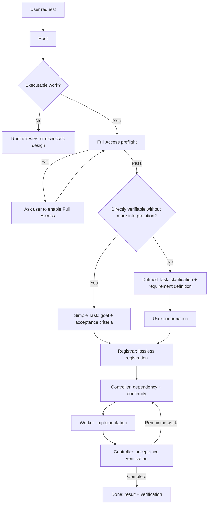

# Task Mecca Session Guide

Task Mecca documentation starts with what the user needs to do first. Internal role, permission, and lifecycle rules follow the Quick Start.

# Quick Start — User workflow

## 1. Launch the dashboard

From the project root:

```bash
task-mecca web
```

`task-mecca web` starts a user-level singleton Web service in the background and opens the browser. The default port is `18765`; Task Mecca does not silently increment to another port. If the Web service is already running, the existing instance and URL are reused. With the default `--host auto`, Task Mecca serves local HTTP on `127.0.0.1:18765` and, when Tailscale is detected, directly serves HTTPS on the Tailscale interface using the same port. On Windows/Linux, the local Web service becomes available first while Tailscale HTTPS certificate setup finishes in the background, so a slow first certificate provision does not turn local startup into a false failure. The remote URL is `https://<machine>.<tailnet>.ts.net:18765`. Tailscale Serve is not required. Use `--host <ip>` or `--port <port>` to override explicitly. The dashboard is read-only and shows backlog state, subagent workload, lifecycle timing, Needs Attention, and access observations.


Web service controls:

```bash
task-mecca web status
task-mecca web restart
task-mecca web stop
task-mecca web logs
task-mecca web logs --follow
task-mecca web --foreground
```

Background state and logs are stored under the user-level `~/.task-mecca/web/` directory. If the default port `18765` is occupied by another program, Task Mecca reports an error instead of silently moving to `18766`; use `--port` when an explicit override is needed.

For direct Tailscale HTTPS, MagicDNS and HTTPS Certificates must be enabled in the Tailscale admin DNS settings. Task Mecca stores the issued certificate under `~/.task-mecca/web/tls/` and renews it only when needed. If HTTPS provisioning is unavailable, `task-mecca web status` reports the reason.

Backlog ledgers are detected automatically under `_task_mecca`. New projects use canonical `data/backlog/`; compatibility remains for names beginning with `backlog`, including `data/backlog_b` and legacy `backlog_b`. Canonical `data/backlog/` has highest priority. The top-bar **Backlog** selector can override the choice; **Auto** restores automatic selection.

`archive/YYYY-MM/*.md` is read recursively. Current and completed tasks appear in one Backlog screen. `All` is the default status filter; `Ready / Working / Hold / Blocked / Done` can be combined.

Default sort is `ID ↓`. `ID ↑ / Updated newest / Updated oldest` are also available. Updated ordering uses the backlog item's last update timestamp. The list has a dedicated **Updated** column with both relative and concrete date/time so recency is visible without opening a task.

Page size defaults to **Auto** and is calculated from viewport height and measured row height. Fixed `10 / 20 / 50` sizes remain available.

Keyboard navigation: `↑/↓`, `Enter/→`, `←/Esc`, `/`, and `PgUp/PgDn`.

The top bar includes a **Language** dropdown. `한국어` and `English` are currently supported. The selected language is persisted in `localStorage`. UI text, generated states/messages, controls, and the User Manual follow the selection. Backlog Markdown authored by users is never machine-translated. Additional languages can be added through the language registry and matching localized manual files.


## 2. Activate the Root session

Task Mecca installation and Root activation are deliberately separate.

```text
Task Mecca installed in the project ≠ this session is Root
```

Task Mecca does not create or modify the project-level `AGENTS.md`. Choose the **one user-facing session** that should act as Root and paste the English prompt from:

```text
_task_mecca/ROOT_PROMPT.md
```

Only that explicitly activated session acts as `/root`. It is normal for a fresh installation to have no `data/` directory or backlog; Registrar creates canonical `_task_mecca/data/backlog/` on the first registration.

## 3. Assign work

No special command syntax is required. Describe what should change, why, relevant constraints, and completion conditions.

Root classifies executable work into two lanes:

- **Simple Task** — bounded work with an unambiguous goal and directly verifiable acceptance criteria. Record `Goal + Acceptance criteria` and register without a formal confirmation round-trip.
- **Defined Task** — work requiring scope, design, user choices, decomposition, preservation constraints, or explicit acceptance criteria. Root clarifies the request, writes the requirement definition, and gets user confirmation before registration.

If classification is ambiguous, use Defined Task.

The detail UI is ordered as `Overview → Lifecycle → contract → execution/notes/result/verification`. A floating TOC is available on wide screens; narrow screens expose the same TOC through a floating button.

---

# Operating rules

## 4. Root bootstrap for the first executable request

At the first executable request of a session, Root performs the following automatically:

1. Assume this session was explicitly activated with `ROOT_PROMPT.md`; also read any project-specific instructions and this `SESSION_GUIDE`.
2. Read `_task_mecca/framework/collab.md` and `_task_mecca/framework/roles/root.md`.
3. Before spawning Registrar/Controller/Workers, run:

```bash
task-mecca preflight --require-full-access --json
```

4. Proceed only when `access.orchestration_ready == true`.
5. If status is `restricted` or `unknown`, do not spawn a subagent. Ask the user to enable Full Access, then rerun the effective probe.

Non-executable discussion is not blocked by this gate.

### Event-driven execution handoff

Execution-authorized work must not wait for another Root user turn after Registrar or Worker completion.

- Root prepares an exact `/root/controller` runtime identity before dispatching Registrar.
- Registrar directly messages or resumes Controller after successful registration.
- Worker directly messages or resumes Controller when reporting DONE/BLOCKED.
- Resuming a completed agent starts a new turn and therefore requires a fresh Full Access preflight.
- A message to a currently running agent is distinct from resuming a completed agent.
- Missing, ambiguous, cancelled, or permission-blocked targets are not recorded as successful handoffs.\n- Use `task-mecca handoff capability show <provider> --json`; runtime smoke-test evidence recorded with `capability record` overrides builtin baselines, so dispatch does not rely on provider names alone.
- See `collab.md` and `roles/*.md` for the canonical protocol.

`_task_mecca/.runtime/handoffs/events.jsonl` is ephemeral orchestration evidence and does not replace the backlog/Git contract.

## 5. When Full Access is not confirmed

`preflight --require-full-access` returns `full`, `restricted`, or `unknown`.

With `restricted`/`unknown`, Root must not:

- transition todo → doing
- record Agent claim
- dispatch a worker
- "try anyway" and recover later

The Web UI only shows the last observed access state. A fresh active preflight is always the final dispatch gate.

## 6. User-originated task definition — two lanes



### Simple Task

Use Simple Task only when all of the following are true:

- the requested result is unambiguous
- the scope is small and bounded
- no new product/UX/design choice is required
- completion can be verified directly from the request
- no decomposition into multiple independent backlog items is needed

Simple Task uses `## Task Definition` with `Goal` and `Acceptance criteria`.

### Defined Task

Use Defined Task when any of the following apply:

- meaning or priority is ambiguous
- in/out scope requires agreement
- product behavior, UX, data model, or design decisions require user judgment
- acceptance criteria need separate definition
- multiple requirements are coupled or decomposition is required
- preservation constraints are important
- the user explicitly requests requirement-definition/design confirmation

Registrar never changes the lane chosen by Root.

## 7. Dispatch invariant

Every real worker dispatch must follow:

```text
fresh active Full Access preflight
        +
fresh backlog state confirmed
        +
worker identity/scope decided
        ↓
todo → doing + Agent claim
        ↓
subagent dispatch
```

Never reverse this order.

## 8. Web UI

The Web UI is a projection of Markdown/Git state and does not edit backlog files.

It supports:

- automatic backlog discovery and manual override
- recursive `archive/YYYY-MM/` history
- unified Backlog with multi-select status filters
- default `ID ↓` sort and Updated-based alternatives
- dedicated **Updated** list column with relative + date/time display
- adaptive Auto page size
- keyboard navigation
- Simple/Defined/legacy task rendering
- Overview → Lifecycle ordering
- floating task TOC
- Subagent Workload
- Queue / Active / Wait / Lead timers
- Needs Attention and runtime health
- System / Light / Dark themes
- **Language dropdown** with `한국어 / English`, persisted in browser storage
- localized UI chrome, generated messages, statuses, and User Manual
- Markdown tables/checklists and Mermaid diagrams
- raw Markdown view

User-authored backlog content remains in its original language. Translation applies to Task Mecca-owned UI and manuals, not project content.

### Timing definitions

- Queue = registration → first start
- Active = cumulative `doing`
- Wait = cumulative `hold`
- Lead = registration → completion/current time

Committed Git transitions are durable evidence. `_task_mecca/.runtime/lifecycle_observations.json` stores first-observed uncommitted state transitions so timing does not reset while a state change is pending commit. Git replaces provisional observations when durable evidence arrives.

For older completed tasks where no `doing` transition was ever committed or observed, Active/Queue are displayed as `-`, not misleading `00:00` values.

## 9. Worker stale/death handling

Optional runtime registry files live under `_task_mecca/.runtime/agents/*.json` and are ignored by Git.

Default thresholds:

```text
TASK_MECCA_STALE_WARN_SECONDS=1800
TASK_MECCA_STALE_CRITICAL_SECONDS=3600
```

- no registry → `Runtime unknown`
- live worker with long silence → `Quiet` / `Stale`
- registry exists but assigned doing worker is absent → `Worker missing`
- `stale != dead`; warnings do not automatically mutate backlog state

## 10. Resume behavior

Do not repeat bootstrap on every user message. Re-run the active access gate when a new subagent batch starts, permissions change, earlier workers show permission-related failure, or runtime context is uncertain.

The goal is to keep safety checks automatic and quiet, asking the user only when action is actually required.

## Distribution boundary

Filesystem layout mirrors ownership:

- `_task_mecca/framework/**`: Task Mecca framework and customizable policy/docs
- `_task_mecca/data/**`: durable project/agent data; never overwritten by the migrator
- `_task_mecca/.runtime/**`: ephemeral runtime state
- `_task_mecca/backups/**`: migrator safety backups
- pre-0.2 `_task_mecca/backlog*/**`: legacy project-data compatibility

The installer does not pre-create `data/` or a backlog. On first registration Registrar calls `ensure-backlog`, reuses an existing ledger when present, and otherwise creates canonical `data/backlog/`. Durable audit/measurement/test evidence created by agents belongs under `data/`; Task Mecca does not standardize arbitrary artifact subfolder names.

When an upstream update would replace locally customized managed documents, the migrator shows the affected files, recommends and creates a local backup when approved, explains that the customized copies will be overwritten, and asks for final confirmation. It does not attempt semantic auto-merge of role or policy documents.

### Root-session resynchronization after migration

An already-running Root session may still carry instructions that it read before migration. Therefore, if migration actually changes any of the following operational instruction files, the current Root session **must be resynchronized**:

- `_task_mecca/ROOT_PROMPT.md`
- `_task_mecca/framework/SESSION_GUIDE.md`
- `_task_mecca/framework/SESSION_GUIDE.en.md`
- `_task_mecca/framework/collab.md`
- `_task_mecca/framework/roles/*.md`

A migration that only changes Web UI/CSS/runtime implementation and does not alter session behavior does not require this resynchronization.

When migration is run from the Web UI, the migrator determines whether upstream instruction files actually changed. If resynchronization is required, the completion dialog provides a copyable prompt that can be pasted directly into the **current Root session**. Before starting another subagent dispatch or execution step, Root rereads the latest `ROOT_PROMPT.md`, the session guide for the active language, `collab.md`, and `roles/root.md`, then reapplies the current operating rules.

There is no need to create a new Root session solely because of migration. The existing session can continue after it has reread and reapplied the updated instructions.
