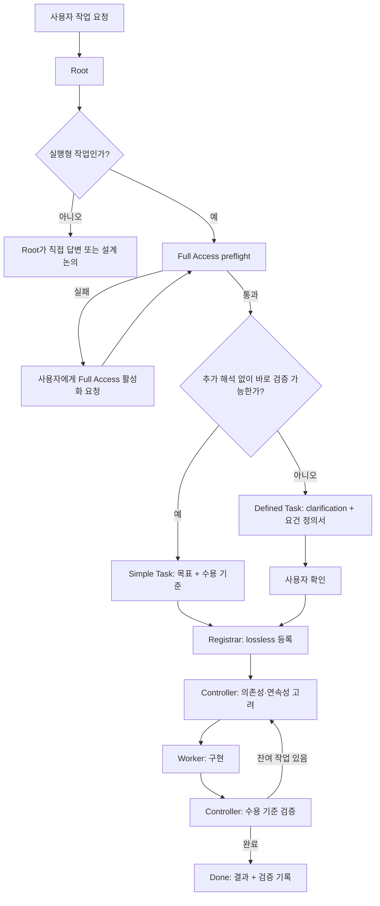

# Task Mecca Session Guide

Task Mecca의 사용자 가이드는 **사용자가 실제로 무엇을 먼저 해야 하는가**를 기준으로 시작한다.
내부 역할·권한·lifecycle 규칙은 Quick Start 뒤의 운영 규칙에서 설명한다.

# Quick Start — 사용자 사용법

## 1. 대시보드 실행

프로젝트 루트에서 다음을 실행한다.

```bash
task-mecca web
```

브라우저가 열리며 기본 주소는 `http://127.0.0.1:8765`다. 대시보드는 read-only/local-only이며
backlog, Subagent Workload, lifecycle timer, Needs Attention, Full Access 상태를 보여준다.

대시보드는 `_task_mecca` 아래에서 백로그 원장을 자동 탐지한다. 신규 프로젝트의 canonical 위치는 `data/backlog/`이며, 기존 호환성을 위해 이름이 `backlog`로 시작하는 `data/backlog_b`, legacy `backlog_b` 같은 경로도 읽는다. canonical `data/backlog/`가 있으면 우선 선택한다. 상단 `Backlog` 선택기에서 다른 후보로 바꿀 수 있으며 수동 선택값은 브라우저에 유지된다. `Auto`를 선택하면 수동 고정을 해제하고 최근 변경 기준 자동 선택으로 돌아간다.

상단 **Language** 드롭다운에서 `한국어 / English`를 선택할 수 있다. 선택값은 브라우저에 저장되며 Task Mecca UI 문구·상태·메시지·User Manual이 선택 언어를 따른다. 사용자 작성 백로그 Markdown은 원문 그대로 유지한다. 향후 언어는 언어 레지스트리와 해당 번역/매뉴얼 파일을 추가하는 방식으로 확장한다.

`archive/YYYY-MM/*.md`는 재귀적으로 읽는다. Web UI는 상태별 메뉴를 나누지 않고 **Backlog** 한 화면으로 통합한다. 기본은 `All` 단독 선택이며 전체 상태를 `ID ↓` 순으로 페이지 단위 표시한다. 페이지 크기의 기본값은 **Auto**이며 현재 브라우저 높이, 실제 backlog 행 높이, 하단 shortcut bar 여유 공간을 기준으로 한 화면에 들어갈 행 수를 자동 결정한다. 창 크기나 sidebar 폭이 바뀌면 다시 계산하며 `Per page`에서 `10 / 20 / 50`으로 고정할 수도 있다. `Ready / Working / Hold / Blocked / Done` 버튼은 여러 개를 동시에 선택할 수 있고, 개별 필터가 하나 이상 선택되면 `All`이 해제된다. `All`을 다시 누르면 나머지 필터를 모두 해제한다. `ID ↑ / Updated newest / Updated oldest` 정렬도 지원하며, Updated는 backlog 마지막 update 시각 기준이다. 목록에서는 `↑/↓` 이동, `Enter`/`→` 상세 진입, `←`/`Esc` 복귀, `/` 검색, `PgUp/PgDn` 페이지 이동을 사용할 수 있다.


## 2. Root 세션 활성화

Task Mecca 설치와 Root 역할 부여는 의도적으로 분리한다.

```text
프로젝트에 Task Mecca가 설치되어 있음 ≠ 현재 세션이 Root임
```

Task Mecca는 프로젝트 최상위 `AGENTS.md`를 생성하거나 수정하지 않는다. Root로 사용할 **한 개의 user-facing 세션을 사용자가 직접 선택**하고 다음 파일의 한국어 프롬프트를 그 세션에 붙여넣는다.

```text
_task_mecca/ROOT_PROMPT.md
```

명시적으로 활성화한 세션만 `/root` 역할을 수행한다. 설치 직후에는 `data/`와 backlog가 없어도 정상이며, 첫 작업 등록 시 Registrar가 canonical `_task_mecca/data/backlog/`를 생성한다.

## 3. 작업 부여

별도 명령 문법은 없다. Root에게 평소처럼 **무엇을 왜 바꾸고 싶은지**, 필요한 제약이나 완료 조건과 함께 설명한다.

```text
현재 주문 처리 모듈의 재시도 로직을 개선하고 싶습니다.
최대 3회까지 exponential backoff를 적용하고, 기존 API 동작은 깨지지 않아야 합니다.
테스트까지 포함해서 진행해 주세요.
```

Root는 먼저 작업을 두 lane 중 하나로 분류한다.

- **Simple Task**: 추가 해석 없이 목표·완료조건이 명확한 bounded 작업. `## 작업 정의`에 목표와 수용 기준만 기록하고 별도 사용자 재확인 없이 바로 Registrar에 등록한다.
- **Defined Task**: 범위·설계·사용자 선택·작업 분해·별도 수용기준 합의가 필요한 작업. Root가 필요한 질문을 하고 요건 정의서를 작성한 뒤 사용자 확인을 받아 등록한다.

Simple 여부가 애매하면 Defined Task로 승격한다. 작업 크기 자체보다 **추가 해석 없이 바로 검증 가능한지**가 기준이다.

Web UI에서 백로그 상세를 열면 `Overview → Lifecycle → 작업 계약 → 실행/노트/결과/검증` 순서로 표시된다. 넓은 화면에서는 우측 floating TOC가 항상 보이고, 좁은 화면에서는 목차 아이콘으로 같은 TOC 팝오버를 열어 각 섹션을 탐색한다.

긴 요구사항이나 여러 변경사항은 Markdown 파일로 전달해도 된다.

```text
첨부한 requirements.md를 기준으로 작업해 주세요.
불명확한 부분은 등록 전에 먼저 질문해 주세요.
```

사용자는 일반적으로 다음 세 가지만 기억하면 된다.

1. **Root 활성화** — `_task_mecca/ROOT_PROMPT.md`의 프롬프트를 선택한 user-facing 세션에 1회 입력
2. **작업 부여** — 자연어 또는 Markdown으로 요구사항을 Root에게 전달
3. **대시보드** — 필요할 때 `task-mecca web` 실행

프로젝트 전역 `AGENTS.md` 연동은 Task Mecca의 기본 activation mechanism이 아니다.

---

# 운영 규칙

## 4. Root의 첫 실행 bootstrap

새 세션에서 사용자가 **실행형 작업을 처음 요청하는 즉시** Root가 다음을 수행한다. 사용자는 이 절차를 지시할 필요가 없다.

1. 현재 세션이 `ROOT_PROMPT.md`로 명시적으로 Root 활성화되었음을 전제로, 프로젝트 자체의 필수 지시가 있으면 함께 읽고 이 `SESSION_GUIDE.md`를 확인한다.
2. `_task_mecca/framework/collab.md`와 `_task_mecca/framework/roles/root.md`를 읽는다.
3. 요구사항을 길게 정제하거나 Registrar/Controller를 생성하기 전에 다음 effective access gate를 먼저 실행한다.

```bash
task-mecca preflight --require-full-access --json
```

4. `access.orchestration_ready == true`이면 요구사항 정제와 이후 Registrar/Controller/worker dispatch를 정상 진행한다.
5. `restricted`/`unknown`이면 **다른 subagent를 생성하기 전에** 사용자에게 Full Access 활성화를 먼저 요청한다.
6. Root는 config 파일의 `sandbox_mode` 문자열, 제품 UI 라벨, 사용자의 "켜져 있다"는 말만으로 gate를 통과시켜서는 안 된다.
   반드시 현재 세션에서 effective probe를 다시 실행한다.

단순 질의·설계 논의처럼 subagent 실행이 전혀 필요 없는 대화는 이 gate 때문에 막지 않는다. 그러나 실제 Task Mecca
위임 단계로 넘어가기 전에는 반드시 통과해야 한다.

## 5. Full Access가 확인되지 않을 때

`preflight --require-full-access`는 다음 중 하나를 반환한다.

- `full`: effective filesystem access와 orchestration 필수 probe 확인
- `restricted`: 현재 sandbox 신호 또는 필수 probe 실패
- `unknown`: 안전하게 Full Access를 확정할 수 없음

`restricted` 또는 `unknown`이면 Root는 **subagent를 실행하지 않는다.** 또한 다음을 하지 않는다.

- todo → doing 전환
- Agent claim 기록
- worker 생성/재사용 dispatch
- "일단 실행해 보고 실패하면 복구" 방식의 시도

대신 사용자에게 간결하게 알린다.

> 현재 세션에서 Full Access가 확인되지 않아 subagent 실행을 시작하지 않았습니다. Codex의 권한 설정에서
> Full Access를 활성화한 뒤 알려주세요. 활성화 후 제가 preflight를 다시 확인하고 이어서 진행하겠습니다.

사용자가 활성화했다고 알려오면 **같은 preflight를 다시 실행**한다. 재검증 성공 전에는 dispatch하지 않는다.

`CODEX_SANDBOX` 같은 현재 런타임 신호는 config보다 우선한다. `~/.codex/config.toml`은 진단용 hint일 뿐
현재 세션의 effective permission을 증명하지 않는다.

Network는 filesystem Full Access와 별도 신호다. `CODEX_SANDBOX_NETWORK_DISABLED`가 관측되면 Web UI와
preflight에 표시한다. 네트워크가 필요한 작업은 그 권한도 별도로 확인한다.

## 6. 사용자 기원 작업 정의 — 두 lane

Full Access gate와 별개로 Root는 실행형 요청을 먼저 Simple Task와 Defined Task로 분류한다.



### Simple Task

다음을 모두 만족하면 Simple Task로 처리할 수 있다.

- 요청 결과가 추가 해석 없이 명확하다.
- 변경 범위가 작고 bounded하다.
- 제품 동작·UX·설계 방향에 대한 새 사용자 선택이 필요하지 않다.
- 완료 여부를 사용자 요청 자체에서 직접 검증할 수 있다.
- 여러 독립 backlog item으로 분해할 필요가 없다.

Simple Task는 `## 작업 정의` 아래 `### 목표`, `### 수용 기준`만 기록한다. 사용자의 원 요청이 이미 충분한 계약이므로
형식적인 요건정의서와 사용자 confirmation round-trip을 추가하지 않는다.

### Defined Task

다음 중 하나라도 해당하면 Defined Task다.

- 요구사항 의미나 우선순위가 불명확하다.
- 포함/제외 범위 합의가 필요하다.
- 제품 동작, UX, 데이터 모델, 설계 선택 등 사용자 판단이 필요하다.
- 수용 기준을 별도로 정의해야 한다.
- 여러 요구사항이 얽혀 있거나 작업 분해가 필요하다.
- 기존 동작 보존 조건이나 중요한 제약을 명시해야 한다.
- 사용자가 명시적으로 요건정의 또는 설계 합의를 요청했다.

Defined Task는 Root가 필요한 만큼 사용자와 확인하고 `## 요건 정의서`를 작성한 뒤 사용자 확인을 받은 확정본만 등록한다.

### 공통 원칙

- 애매하면 Defined Task로 승격한다.
- Registrar는 Root가 고른 lane을 임의 변경하지 않는다.
- `## 작업 정의`와 `## 요건 정의서`는 각각 해당 task의 canonical contract다.
- Simple Task 수행 중 사용자 판단이 필요한 숨겨진 요구가 드러나면 임의 진행하지 않고 Root에 올려 Defined Task 수준으로 재정의한다.
- 작업 분해가 필요하면 Registrar가 아니라 Root가 결정한다.
- 등록 이후 Root는 backend 완료를 기다리는 polling으로 사용자 대화를 막지 않는다.

실행형 요청임이 명확한 새 세션에서는 access gate를 **초기 필수 절차**로 취급한다. 권한이 제한된 상태에서 긴 요건 논의를
먼저 끝낸 뒤 위임 직전에 처음 발견하는 흐름을 정상 경로로 삼지 않는다. 단, 권한 문제를 알린 뒤 사용자가 설계 논의만 계속하길
원하면 subagent 없이 Root 대화를 이어갈 수 있다.

## 7. Dispatch 불변조건

Root/Controller는 **worker를 실제 dispatch하기 직전에 자동으로 active preflight를 다시 실행**하고 다음을 만족해야 한다.
사용자에게 수동 preflight 실행을 요구하는 것은 자동 재검증이 실패했을 때뿐이다.

```text
fresh active Full Access preflight
        +
fresh backlog state confirmed
        +
worker identity/scope decided
        ↓
todo → doing + Agent claim
        ↓
subagent dispatch
```

순서를 뒤집지 않는다. 특히 권한을 확인하기 전에 backlog를 doing으로 만들면 실제 worker 없이 작업만 진행 중으로 남을
수 있다. 같은 세션에서 앞서 Full Access가 확인되었더라도 **각 dispatch 시점의 active preflight가 최종 gate**다.

Full Access 검증 cache는 `_task_mecca/.runtime/access_preflight.json`에 저장되며 Git 원장이 아니다. cache는 Web UI에서
`마지막 확인 상태/시각`을 보여주는 관측 이력일 뿐 dispatch 권한으로 사용하지 않는다. 기본 freshness 기준(900초)이 지나도
대시보드는 과거 성공값을 `unknown`으로 강등하거나 경고 배너를 띄우지 않는다. 대신 마지막 확인 후 경과시간을 중립적으로
표시하며, 실제 dispatch 순간에 fresh active preflight가 자동 실행된다.

환경변수는 UI에서 cache가 오래되었는지 표시하는 내부 기준으로만 사용할 수 있다.

```text
TASK_MECCA_ACCESS_CACHE_SECONDS=900
```

## 8. Web UI

Web UI는 Markdown/Git 원장의 projection이며 직접 backlog를 수정하지 않는다.

- 통합 backlog, 검색, Simple Task 작업 정의 / Defined Task 요건 정의 상세
- **Subagent Workload**: Agent별 doing / downstream blocking / ready continuity와 현재 task timer·health
- 좌측 메뉴 접기/펼치기: 펼침 상태는 아이콘+메뉴명, 접힘 상태는 아이콘만 표시하며 브라우저에 선택 상태를 기억한다.
- legacy/v2 backlog 렌더링
- Markdown table/checklist
- **Mermaid diagram**: ` ```mermaid ` fenced block 자동 렌더링, source 보기/복사, Light/Dark/System 테마 연동
- **Mermaid runtime**: `web/vendor/mermaid.min.js`가 있으면 로컬 우선, 없으면 classic-script fallback (cdnjs → jsDelivr); 로딩 실패 시 원본 source 표시
- 선행/연관·execution metadata
- Git lifecycle timeline
- Queue / Active / Wait / Lead time
- Queue / Active / Wait / Lead 실시간 timer (해당 구간이 진행 중일 때)
- Queue = 등록→최초 착수, Active = doing 누적, Wait = hold 누적, Lead = 등록→완료/현재
- Git state transition commit보다 현재 backlog filename state가 앞서 있으면 provisional worktree lifecycle event로 보정하고 UI에 명시한다. 실제 commit 이후 Git event가 자동 우선한다.
- Needs Attention: quiet / stale / worker missing
- **전역 Full Access / Restricted / Unknown 표시**
- **Theme 선택**: System / Light / Dark (브라우저 localStorage에 선택 유지)
- Raw Markdown 확인
- **Backlog 자동 탐지/선택**: `backlog` 이름 우선 + 최근 변경 후보 자동 선택, 상단 선택기로 수동 변경
- **Unified Backlog**: 현재/완료 작업을 한 화면에 통합하고 `All / Ready / Working / Hold / Blocked / Done` 버튼형 다중 필터 제공
- **Archive history**: `archive/YYYY-MM/` 재귀 읽기, `ID ↓` 기본 정렬, Auto page size 기본값 및 Updated 기준 정렬 변경
- **Keyboard navigation**: `↑/↓`, `Enter/→`, `←/Esc`, `/`, `PgUp/PgDn`

Web UI 시작은 active access probe를 강제하지 않는다. 마지막 preflight 관측값과 현재 프로세스에서 직접 보이는 restriction만
참고 정보로 표시한다. backlog 열람은 막지 않으며, 실제 subagent dispatch 직전에 fresh active preflight를 수행한다.

## 9. Worker 정체/사망 대응

선택적 runtime registry는 `_task_mecca/.runtime/agents/*.json`에 두며 Git에 포함하지 않는다.

```json
{"agent":"/root/controller/kkobugi","task_id":"A-143","heartbeat_at":"2026-09-17T13:00:00+09:00","state":"working"}
```

기본 정체 임계값:

```text
TASK_MECCA_STALE_WARN_SECONDS=1800
TASK_MECCA_STALE_CRITICAL_SECONDS=3600
```

- registry가 없으면 liveness는 `Runtime unknown`이다.
- live worker가 있으나 오랫동안 활동이 없으면 `Quiet`/`Stale`로 경고한다.
- registry가 존재하는데 doing의 assigned worker가 없을 때만 `Worker missing`을 강한 경고로 표시한다.
- `stale != dead`. 경고만으로 자동 hold/done 처리하지 않는다.
- Controller는 실제 live agent 상태를 확인하고 필요하면 재배정한다.

## 10. 세션 재개

같은 세션이나 resume에서 이미 문서를 읽었다면 매 사용자 메시지마다 bootstrap을 반복하지 않는다. 다만 다음 경우
Full Access preflight는 다시 실행한다.

- 새 subagent batch를 처음 시작할 때
- 권한 설정을 사용자가 변경한 뒤
- access cache가 stale일 때
- 이전 worker가 권한 문제로 중단된 정황이 있을 때
- runtime이 바뀌었거나 현재 permission을 확신할 수 없을 때

목표는 절차를 사용자에게 떠넘기는 것이 아니라 **Root가 조용히 안전 조건을 확인하고, 문제가 있을 때만 사용자에게
필요한 한 가지 조치를 요청하는 것**이다.


> Backlog detail TOC: wide screens show the right-side TOC rail. On narrower screens, use the floating list icon to open the same TOC; it is no longer hidden by viewport width.

### Lifecycle timing accuracy

Task Mecca keeps committed Git transitions as the durable lifecycle source, and also records the first observed uncommitted state transition in `_task_mecca/.runtime/lifecycle_observations.json`. This prevents `Active Time` or `Wait Time` from resetting when a `doing`/`hold` backlog file is edited before its lifecycle commit lands. The runtime journal is ephemeral, ignored by Git, and is replaced by Git evidence when the transition is committed.

For older completed tasks where no `doing` transition was ever committed or observed, `Active Time` and `Queue Time` are shown as `-` rather than a misleading `00:00`. `Lead Time` remains available when registration/completion timestamps are known.

## 배포 경계

파일시스템 경계도 ownership을 그대로 반영한다.

- `_task_mecca/framework/**`: Task Mecca framework 및 customizable policy/document
- `_task_mecca/data/**`: project/agent가 축적하는 durable data. migrator가 절대 덮어쓰지 않는다.
- `_task_mecca/.runtime/**`: ephemeral runtime state
- `_task_mecca/backups/**`: migrator 안전 백업
- pre-0.2 `_task_mecca/backlog*/**`: legacy project-data compatibility

Installer는 `data/`나 backlog를 미리 만들지 않는다. 첫 등록 시 Registrar가 `ensure-backlog`를 호출해 기존 ledger를 사용하거나, 없을 때만 canonical `data/backlog/`를 만든다. Agent가 audit/measurement/test evidence 같은 durable 부산물을 만들 필요가 있으면 framework와 섞지 말고 `data/` 아래에 둔다. 하위 폴더명 자체는 Task Mecca가 강제하지 않는다.

upstream migration가 사용자가 수정한 managed Task Mecca 문서를 덮어쓰게 되는 경우 migrator는 대상 파일 목록을 보여주고, 백업을 권장하며, 동의 시 로컬 백업을 실제 생성한 뒤 수정본이 공식 새 버전으로 덮어써짐을 안내하고 최종 확인을 받아야 한다. 역할·정책 문서의 의미 기반 자동 merge는 시도하지 않는다.

### 마이그레이션 후 Root 세션 재동기화

현재 실행 중인 Root 세션은 마이그레이션 전에 읽은 지침을 계속 문맥으로 가지고 있을 수 있다. 따라서 migration이 다음 운영 지침 파일군을 실제로 변경했다면 현재 Root 세션을 **재동기화해야 한다.**

- `_task_mecca/ROOT_PROMPT.md`
- `_task_mecca/framework/SESSION_GUIDE.md`
- `_task_mecca/framework/SESSION_GUIDE.en.md`
- `_task_mecca/framework/collab.md`
- `_task_mecca/framework/roles/*.md`

단순 Web UI/CSS/runtime 구현 변경처럼 세션 행동 규칙이 바뀌지 않은 migration에는 재동기화를 요구하지 않는다.

Web UI에서 migration을 실행하면 migrator가 실제 upstream instruction 변경 여부를 판정한다. 재동기화가 필요하면 완료 팝업에서 현재 Root 세션에 그대로 붙여넣을 수 있는 프롬프트를 제공한다. 사용자는 이 프롬프트를 복사해 **현재 Root 세션**에 전달한다. Root는 새 subagent dispatch나 새 실행 단계를 시작하기 전에 최신 `ROOT_PROMPT.md`, 현재 언어의 `SESSION_GUIDE`, `collab.md`, `roles/root.md`를 다시 읽고, 변경된 운영 규칙을 현재 세션에 재적용한 뒤 작업을 계속한다.

Root 세션 자체를 새로 만들 필요는 없다. 최신 지침 재읽기와 재적용이 완료되면 기존 세션을 계속 사용할 수 있다.
