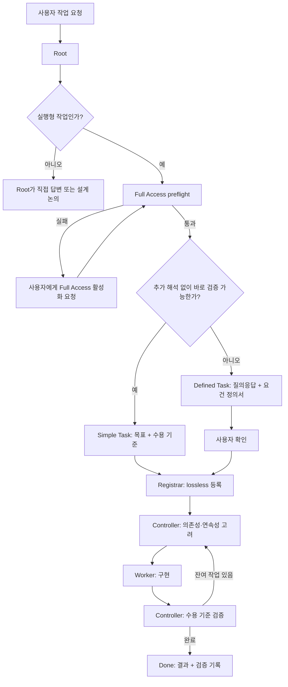

# Task Mecca

처음 사용할 때는 아래 세 단계만 따르면 된다.

## 1. 대시보드 실행

```bash
uv run _task_mecca/collab_tools.py web
```

대시보드는 프로젝트 안에서 백로그 폴더를 자동 탐지한다. 폴더명에 `backlog`가 포함된 후보를 우선하고, 여러 후보가 있으면 active 및 `archive/**`/`_complete/**` 작업 파일의 최근 변경 시각이 가장 최신인 폴더를 자동 선택한다. 상단 **Backlog** 선택기에서 다른 후보로 즉시 바꿀 수 있고, `Auto`를 선택하면 다시 최근 변경 기준 자동 선택으로 돌아간다. 상단 **Language** 드롭다운에서는 `한국어 / English`를 선택할 수 있으며 선택값은 브라우저에 저장된다. Task Mecca UI 문구·상태·메시지·User Manual은 선택 언어를 따르며, 사용자가 작성한 백로그 Markdown 원문은 자동 번역하지 않는다.

`archive/YYYY-MM/` 아래의 완료 작업도 자동으로 읽는다. Web UI의 **Backlog** 한 화면에서 현재 작업과 완료 작업을 함께 조회하며, 기본 `All` 필터는 전체 상태를 표시한다. `Ready / Working / Hold / Blocked / Done`은 버튼형 다중 필터로 조합할 수 있고 `All`을 누르면 개별 필터가 해제된다. 정렬 기본값은 `ID ↓`이며 `ID ↑ / Updated newest / Updated oldest`로 바꿀 수 있다. 목록에는 **독립된 Updated 컬럼**을 두어 상대시간과 실제 날짜/시각을 함께 표시하므로 상세 진입 없이 최근 갱신 시점을 확인할 수 있다. Updated 정렬은 backlog의 마지막 update 시각(파일 수정 또는 최신 lifecycle event)을 기준으로 한다.

목록은 기본적으로 **Auto page size**를 사용해 현재 브라우저 높이에 들어가는 백로그 행 수를 자동 계산한다. 창 크기나 사이드바 폭이 바뀌면 다시 계산되며, 필요하면 `Per page`에서 `10 / 20 / 50`으로 고정할 수 있다. 목록 키보드 탐색은 `↑/↓` 이동, `Enter` 또는 `→` 상세 진입, `←` 또는 `Esc` 복귀, `/` 검색, `PgUp/PgDn` 페이지 이동을 지원한다.

백로그 상세 화면에서는 `Overview` 바로 아래에 `Lifecycle`을 배치한다. 넓은 화면에서는 우측에 현재 섹션을 따라가는 floating TOC를 표시하고, 좁은 화면에서는 우측 목차 아이콘을 눌러 같은 TOC를 팝오버로 연다. TOC 항목을 누르면 해당 섹션으로 즉시 이동한다.
좌측 메뉴의 화살표 버튼으로 사이드바를 접거나 펼칠 수 있다. 펼치면 아이콘+메뉴명, 접으면 아이콘만 표시되며 선택 상태는 브라우저에 저장된다.
Web UI의 **User Manual**에서 코드블럭 우측 상단의 복사 아이콘을 누르면 해당 명령/프롬프트를 원클릭으로 복사할 수 있다.

대시보드의 Full Access 표시는 마지막 검증 상태와 경과시간을 보여주는 참고 정보다. 시간이 지났다는 이유만으로 경고하지 않으며,
Task Mecca는 subagent를 실제 dispatch하기 직전에 fresh active preflight를 자동 실행한다. 실패할 때만 사용자에게 Full Access 활성화를 요청한다.

### 시간 지표

- **Queue Time**: 백로그 등록 후 최초 `doing` 착수까지의 시간
- **Active Time**: 모든 `doing` 구간의 누적 시간
- **Wait Time**: 모든 `hold` 구간의 누적 시간
- **Lead Time**: 백로그 등록부터 완료까지의 전체 시간. 미완료 작업은 현재까지 계속 증가한다.

현재 파일 상태가 Git lifecycle의 마지막 commit보다 앞서 있는 경우(예: `todo → doing` rename은 됐지만 lifecycle commit 전), Web UI는 현재 파일 상태를 무시하지 않는다. 파일 시스템의 관측 시각으로 **provisional lifecycle event**를 만들어 Queue/Active/Wait를 임시 보정하고 Lifecycle에 `provisional`로 표시한다. 실제 state transition commit이 기록되면 이 임시 이벤트는 자동으로 Git 이벤트로 대체된다.

`uv`를 사용하지 않는 환경에서는:

```bash
python _task_mecca/collab_tools.py web
```

## 2. Root 설정

프로젝트 최상위 `AGENTS.md`에 `AGENTS_TASK_MECCA_SNIPPET.md`가 이미 통합되어 있으면 별도 설정이 필요 없다.
자동 연동이 없다면 새 세션에서 다음 프롬프트를 한 번 입력한다.

```text
이 세션에서는 Task Mecca의 Root로 동작해 주세요.
먼저 _task_mecca/SESSION_GUIDE.md, _task_mecca/collab.md, _task_mecca/roles/root.md를 읽고 그 규약을 따르세요.
실행형 작업을 subagent에 위임하기 전에는 SESSION_GUIDE의 Full Access preflight를 먼저 수행하세요.
작업을 Simple Task와 Defined Task로 구분하세요. 추가 해석 없이 바로 검증 가능한 단순 작업은 목표와 수용 기준만 기록하고 바로 등록하며, 범위·설계·사용자 선택이 필요한 작업만 요건 정의서를 작성해 제 확인을 받은 뒤 Registrar에 lossless하게 등록하세요.
등록 이후에는 Controller가 작업 연속성과 의존성을 고려해 Worker에 배분하도록 하고, Root는 사용자-facing 창구로 유지하세요.
```

## 3. 작업 부여

별도 명령은 없다. Root에게 자연어 또는 Markdown으로 작업을 설명한다.

```text
README의 잘못된 명령어 표기 하나를 바로잡아 주세요.
```

이처럼 요청 자체로 목표와 완료조건이 명확한 작업은 **Simple Task**다. 별도 요건정의서나 확인 절차 없이 `작업 정의(목표 + 수용 기준)`만 남기고 바로 등록·실행한다.

```text
백로그 자동 탐색 방식을 개선하고 archive, 필터, 정렬 규칙까지 함께 바꾸고 싶습니다.
기존 호환성도 유지해야 합니다.
```

이처럼 범위·설계·여러 수용기준의 합의가 필요한 작업은 **Defined Task**다. Root가 필요한 질문 → 요건 정의서 → 사용자 확인 → Registrar → Controller → Worker 순서로 진행한다.

Root는 작업 크기가 아니라 **추가 해석 없이 바로 검증 가능한지**를 기준으로 두 lane을 선택한다. 애매하면 Defined Task로 승격한다.

## Task Mecca 작업 흐름



Web UI의 Markdown renderer는 `mermaid` fenced block을 다이어그램으로 표시한다. 기본 배포본은 로컬 `web/vendor/mermaid.min.js`가 있으면 이를 우선 사용하고, 없으면 classic standalone Mermaid 스크립트를 cdnjs, jsDelivr 순서로 시도한다. 다이어그램 우측 상단에서 원본 source를 열거나 복사할 수 있으며 Light/Dark/System 테마 변경 시 현재 테마로 다시 렌더링한다.

자세한 운영 규칙은 Web UI의 `HELP → User Manual → Detailed Operations Guide` 또는 `SESSION_GUIDE.md`에서 확인한다.


> Backlog detail TOC: wide screens show the right-side TOC rail. On narrower screens, use the floating list icon to open the same TOC; it is no longer hidden by viewport width.

### Lifecycle timing accuracy

Task Mecca keeps committed Git transitions as the durable lifecycle source, and also records the first observed uncommitted state transition in `_task_mecca/.runtime/lifecycle_observations.json`. This prevents `Active Time` or `Wait Time` from resetting when a `doing`/`hold` backlog file is edited before its lifecycle commit lands. The runtime journal is ephemeral, ignored by Git, and is replaced by Git evidence when the transition is committed.

For older completed tasks where no `doing` transition was ever committed or observed, `Active Time` and `Queue Time` are shown as `-` rather than a misleading `00:00`. `Lead Time` remains available when registration/completion timestamps are known.

## 설치 및 업데이트 관리 영역

공개 bootstrap package로 설치하면 `_task_mecca/manifest.json`에 설치 버전과 managed file baseline hash가 기록된다.

- **Framework managed**: `collab_tools.py`, `runtime_metadata.py`, `web/*`. upstream 변경 시 자동 업데이트한다.
- **Customizable managed**: `roles/*`, `SESSION_GUIDE*.md`, `collab.md`, `_template.md`, Task Mecca 매뉴얼. 프로젝트 수정과 upstream 변경이 동시에 존재할 때 수정 파일 목록을 보여주고 백업을 권장한다. 동의하면 백업을 만든 뒤 덮어쓰기 전에 다시 안내·확인한다.
- **Project owned**: `backlog_*`, archive 내용, 프로젝트별 설정. updater가 덮어쓰지 않는다.
- **Runtime/backup**: `.runtime/*`, `backups/*`. 로컬 운영/안전 데이터이며 기본적으로 Git에서 제외한다.

사용자가 기억할 일반 업데이트 진입점은 하나다.

```bash
uvx task-mecca update
```

PyPI 공개 전 GitHub 저장소에서 직접 실행할 때는 다음을 사용한다.

```bash
uvx --from git+https://github.com/silverkhan/TaskMecca.git task-mecca update
```
