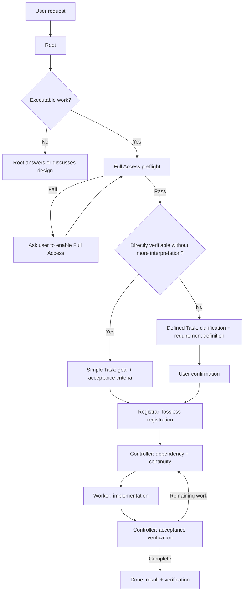

# Task Mecca Session Guide

Task Mecca documentation starts with what the user needs to do first. Internal role, permission, and lifecycle rules follow the Quick Start.

# Quick Start — User workflow

## 1. Launch the dashboard

From the project root:

```bash
uv run _task_mecca/collab_tools.py web
```

The browser dashboard is read-only and localhost-only. It shows backlog state, subagent workload, lifecycle timing, Needs Attention, and access observations.

Backlog folders are detected automatically. Names containing `backlog` are preferred; if several exist, the candidate with the most recent recognized task change across active files and `archive/**` / `_complete/**` is selected. The top-bar **Backlog** selector can override the choice; **Auto** restores automatic selection.

`archive/YYYY-MM/*.md` is read recursively. Current and completed tasks appear in one Backlog screen. `All` is the default status filter; `Ready / Working / Hold / Blocked / Done` can be combined.

Default sort is `ID ↓`. `ID ↑ / Updated newest / Updated oldest` are also available. Updated ordering uses the backlog item's last update timestamp. The list has a dedicated **Updated** column with both relative and concrete date/time so recency is visible without opening a task.

Page size defaults to **Auto** and is calculated from viewport height and measured row height. Fixed `10 / 20 / 50` sizes remain available.

Keyboard navigation: `↑/↓`, `Enter/→`, `←/Esc`, `/`, and `PgUp/PgDn`.

The top bar includes a **Language** dropdown. `한국어` and `English` are currently supported. The selected language is persisted in `localStorage`. UI text, generated states/messages, controls, and the User Manual follow the selection. Backlog Markdown authored by users is never machine-translated. Additional languages can be added through the language registry and matching localized manual files.

Without `uv`:

```bash
python _task_mecca/collab_tools.py web
```

## 2. Configure Root

### Recommended — project `AGENTS.md` integration

Integrate `AGENTS_TASK_MECCA_SNIPPET.md` once into the project-root `AGENTS.md`. New sessions can then enter the Task Mecca workflow without a manual bootstrap prompt.

### Manual Root setup prompt

```text
Act as the Task Mecca Root for this session.
First read _task_mecca/SESSION_GUIDE.md, _task_mecca/collab.md, and _task_mecca/roles/root.md and follow those rules.
Before delegating executable work to subagents, run the Full Access preflight described in SESSION_GUIDE.
Classify work as Simple Task or Defined Task. For a simple task that is directly verifiable without additional interpretation, record only the goal and acceptance criteria and register it immediately. For work requiring scope, design, or user choices, prepare a requirement definition, get my confirmation, and then ask Registrar to register it losslessly.
After registration, let Controller allocate work to Workers based on dependency and continuity, while Root remains the user-facing interface.
```

## 3. Assign work

No special command syntax is required. Describe what should change, why, relevant constraints, and completion conditions.

Root classifies executable work into two lanes:

- **Simple Task** — bounded work with an unambiguous goal and directly verifiable acceptance criteria. Record `Goal + Acceptance criteria` and register without a formal confirmation round-trip.
- **Defined Task** — work requiring scope, design, user choices, decomposition, preservation constraints, or explicit acceptance criteria. Root clarifies the request, writes the requirement definition, and gets user confirmation before registration.

If classification is ambiguous, use Defined Task.

The detail UI is ordered as `Overview → Lifecycle → contract → execution/notes/result/verification`. A floating TOC is available on wide screens; narrow screens expose the same TOC through a floating button.

---

# Operating rules

## 4. Root bootstrap for the first executable request

At the first executable request of a session, Root performs the following automatically:

1. Read project-required instructions and this `SESSION_GUIDE`.
2. Read `_task_mecca/collab.md` and `_task_mecca/roles/root.md`.
3. Before spawning Registrar/Controller/Workers, run:

```bash
uv run _task_mecca/collab_tools.py preflight --require-full-access --json
```

4. Proceed only when `access.orchestration_ready == true`.
5. If status is `restricted` or `unknown`, do not spawn a subagent. Ask the user to enable Full Access, then rerun the effective probe.

Non-executable discussion is not blocked by this gate.

## 5. When Full Access is not confirmed

`preflight --require-full-access` returns `full`, `restricted`, or `unknown`.

With `restricted`/`unknown`, Root must not:

- transition todo → doing
- record Agent claim
- dispatch a worker
- "try anyway" and recover later

The Web UI only shows the last observed access state. A fresh active preflight is always the final dispatch gate.

## 6. User-originated task definition — two lanes



### Simple Task

Use Simple Task only when all of the following are true:

- the requested result is unambiguous
- the scope is small and bounded
- no new product/UX/design choice is required
- completion can be verified directly from the request
- no decomposition into multiple independent backlog items is needed

Simple Task uses `## Task Definition` with `Goal` and `Acceptance criteria`.

### Defined Task

Use Defined Task when any of the following apply:

- meaning or priority is ambiguous
- in/out scope requires agreement
- product behavior, UX, data model, or design decisions require user judgment
- acceptance criteria need separate definition
- multiple requirements are coupled or decomposition is required
- preservation constraints are important
- the user explicitly requests requirement-definition/design confirmation

Registrar never changes the lane chosen by Root.

## 7. Dispatch invariant

Every real worker dispatch must follow:

```text
fresh active Full Access preflight
        +
fresh backlog state confirmed
        +
worker identity/scope decided
        ↓
todo → doing + Agent claim
        ↓
subagent dispatch
```

Never reverse this order.

## 8. Web UI

The Web UI is a projection of Markdown/Git state and does not edit backlog files.

It supports:

- automatic backlog discovery and manual override
- recursive `archive/YYYY-MM/` history
- unified Backlog with multi-select status filters
- default `ID ↓` sort and Updated-based alternatives
- dedicated **Updated** list column with relative + date/time display
- adaptive Auto page size
- keyboard navigation
- Simple/Defined/legacy task rendering
- Overview → Lifecycle ordering
- floating task TOC
- Subagent Workload
- Queue / Active / Wait / Lead timers
- Needs Attention and runtime health
- System / Light / Dark themes
- **Language dropdown** with `한국어 / English`, persisted in browser storage
- localized UI chrome, generated messages, statuses, and User Manual
- Markdown tables/checklists and Mermaid diagrams
- raw Markdown view

User-authored backlog content remains in its original language. Translation applies to Task Mecca-owned UI and manuals, not project content.

### Timing definitions

- Queue = registration → first start
- Active = cumulative `doing`
- Wait = cumulative `hold`
- Lead = registration → completion/current time

Committed Git transitions are durable evidence. `_task_mecca/.runtime/lifecycle_observations.json` stores first-observed uncommitted state transitions so timing does not reset while a state change is pending commit. Git replaces provisional observations when durable evidence arrives.

For older completed tasks where no `doing` transition was ever committed or observed, Active/Queue are displayed as `-`, not misleading `00:00` values.

## 9. Worker stale/death handling

Optional runtime registry files live under `_task_mecca/.runtime/agents/*.json` and are ignored by Git.

Default thresholds:

```text
TASK_MECCA_STALE_WARN_SECONDS=1800
TASK_MECCA_STALE_CRITICAL_SECONDS=3600
```

- no registry → `Runtime unknown`
- live worker with long silence → `Quiet` / `Stale`
- registry exists but assigned doing worker is absent → `Worker missing`
- `stale != dead`; warnings do not automatically mutate backlog state

## 10. Resume behavior

Do not repeat bootstrap on every user message. Re-run the active access gate when a new subagent batch starts, permissions change, earlier workers show permission-related failure, or runtime context is uncertain.

The goal is to keep safety checks automatic and quiet, asking the user only when action is actually required.

## Distribution boundary

The public updater treats Task Mecca files as framework-managed, customizable-managed, project-owned, or runtime/backup data. Backlog data is always project-owned. When an upstream update would replace locally customized Task Mecca documents, the updater must show the affected file list, recommend and create a local backup when approved, explain that the customized copies will be overwritten, and ask for final confirmation. It does not attempt semantic auto-merge of role or policy documents.
